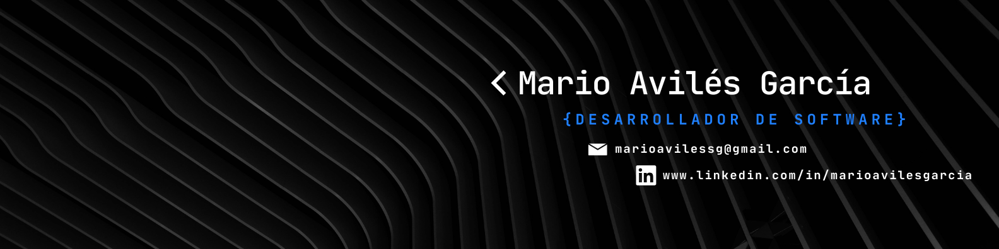

  

## 👋 ¡Hola! Soy Mario Avilés García

---

## 🧠 Sobre mí
Soy un desarrollador enfocado en backend con especial interés en Inteligencia Artificial y Big Data. Me apasiona construir sistemas escalables, integrar tecnologías y explorar soluciones innovadoras basadas en datos y modelos de lenguaje.

---

## 🌍 Información
- 📍 Ubicación: Cartagena, Murcia, España  
- 🎓 Formación: Desarrollo de Aplicaciones Web (DAW) + Especialización en IA y Big Data  
- 💼 Enfoque actual: Desarrollo backend con .NET y exploración de sistemas basados en IA
- 🖥️ Página Web: [Portfolio](https://marioavi.site/) 
- 📫 Contacto: [LinkedIn](https://www.linkedin.com/in/marioavilesgarcia) | marioavilessg@gmail.com

---

## 🚀 Aptitudes principales
- Desarrollo backend con .NET (C#, MAUI, Blazor)  
- Desarrollo de APIs y arquitectura de servicios  
- Java + Spring Boot  
- Bases de datos SQL (PostgreSQL)  
- Integración de sistemas y mensajería (RabbitMQ)  
- Docker y entornos containerizados  
- Desarrollo de soluciones con IA (RAG, LLMs locales)  

---

## 🛠️ Tecnologías
- .NET / C#  
- Java / Spring Boot  
- PostgreSQL  
- Docker  
- RabbitMQ  
- Postman  

---

## 📌 Proyectos destacados

### 🔹 MauiRAG  
Sistema RAG con interfaz en .NET MAUI conectado a modelos de lenguaje locales.  
👉 https://github.com/marioavilessg/MauiRAG  

---

### 🔹 AudioTranslate  
Aplicación de traducción en tiempo real con soporte de voz y mensajería.  
👉 https://github.com/marioavilessg/AudioTranslate  

---

## 🎯 Intereses
- Inteligencia Artificial aplicada  
- Sistemas distribuidos  
- Automatización de procesos  
- Arquitectura backend escalable  
